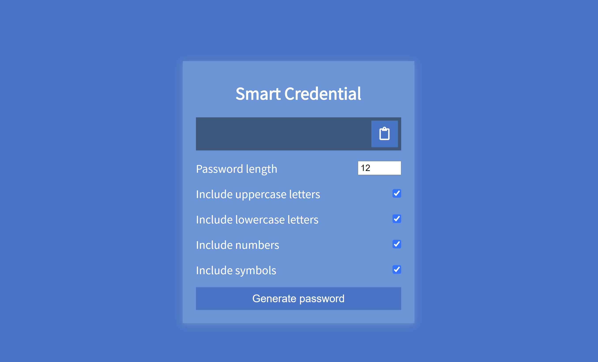

# Smart Credential

Smart Credential is a random password generator that is built with Vue.
Input your desired password length (4-20 characters) and select the specific
character types you would like to include. Generate your password and copy it
to your clipboard to use.



## Project setup

```
npm install
```

### Compiles and hot-reloads for development

```
npm run serve
```

### Compiles and minifies for production

```
npm run build
```

### Lints and fixes files

```
npm run lint
```
