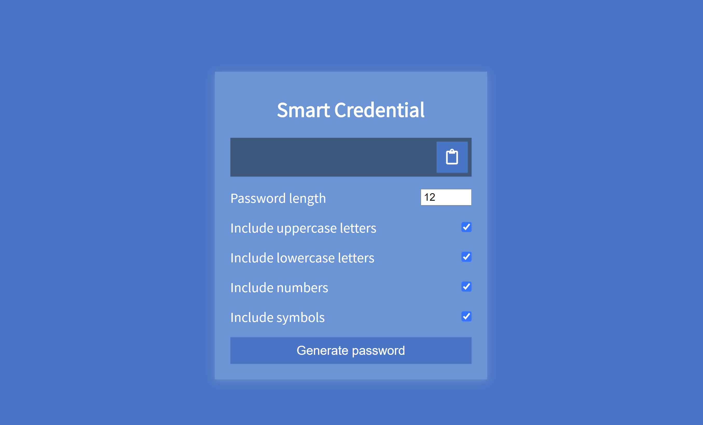

# Smart Credential

Smart Credential is a random password generator that is built with JavaScript. Input your desired password length (4-20 characters) and select the specific character types you would like to include. Generate your password and copy it to your clipboard to use.

